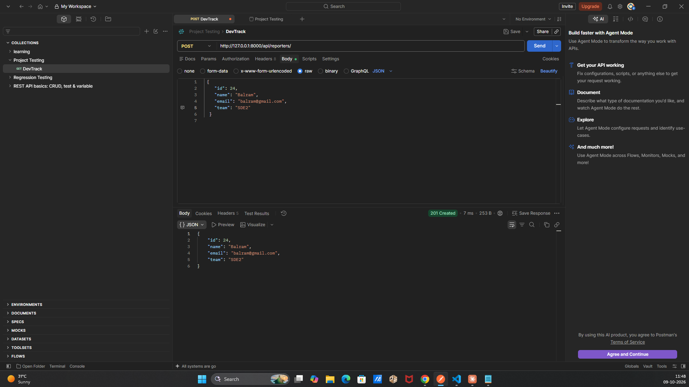
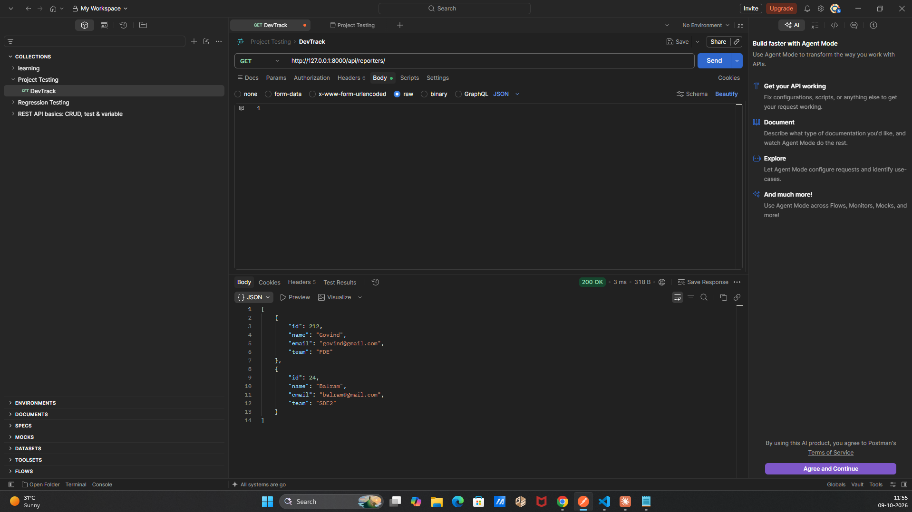
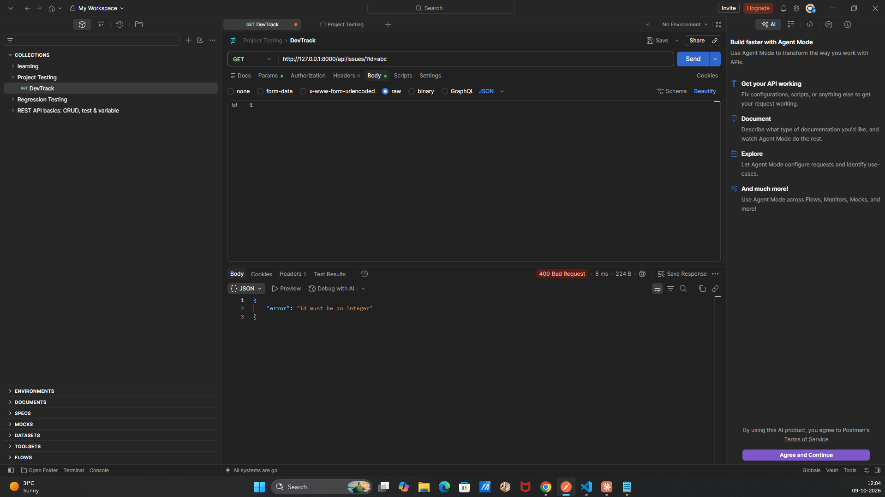

# DevTrack

A small backend API for tracking engineering issues. Engineers register as reporters, file issues, assign priorities and track status.

Built with Django and Django REST Framework. There is **no database and no authentication**. Data is stored in two JSON files.

## Features

- Create and list reporters, and look one up by id.
- Create and list issues, look one up by id, or filter by status.
- Object-oriented models with validation (`BaseEntity`, `Reporter`, `Issue`).
- Priority-based subclasses (`CriticalIssue`, `LowPriorityIssue`) that change the message returned when an issue is created.
- One reporter can file many issues. The `Issue` stores `reporter_id`.

## Tech stack

- Python 3.12 or newer (required by Django 6.1)
- Django 6.1
- Django REST Framework

## Project structure

```
devtrack/                     project root
├── manage.py
├── README.md
├── database/                 JSON "database" (not tracked by git)
│   ├── issues.json
│   └── reporters.json
├── devtrack/                 project configuration
│   ├── settings.py
│   ├── urls.py
│   ├── asgi.py
│   └── wsgi.py
└── issues/                   the app
    ├── models.py             OOP classes: BaseEntity, Reporter, Issue, CriticalIssue, LowPriorityIssue
    ├── storage.py            the only module that reads or writes the JSON files
    ├── views.py              DRF views for /api/reporters/ and /api/issues/
    └── urls.py               routes
```

| Layer | Responsibility |
|---|---|
| `models.py` | Defines what a valid Reporter or Issue is, serializes itself with `to_dict()`, describes itself with `describe()`. No file or HTTP code. |
| `storage.py` | Reads and writes the JSON files. |
| `views.py` | Parses requests, picks the right class, calls storage, returns the response and status code. |

## Setup

```bash
# 1. Create and activate a virtual environment
python -m venv .venv
.venv\Scripts\activate          # Windows
source .venv/bin/activate       # macOS / Linux

# 2. Install dependencies
pip install django djangorestframework

# 3. Create the data files (each holds an empty list)
mkdir database
echo [] > database/issues.json
echo [] > database/reporters.json

# 4. Run the server
python manage.py runserver
```

The API is then available at `http://127.0.0.1:8000/api/`.

Notes:

- Do **not** run `python manage.py migrate`. There is no database.
- On Windows PowerShell 5.1, `echo [] > file` can write UTF-16. If the files misbehave, create them in your editor and type `[]`.
- If the files are missing, they are created on the first successful POST.
- `database/` is listed in `.gitignore`, so test data is not committed.

## API reference

Base URL: `http://127.0.0.1:8000`. Send `Content-Type: application/json` on POST requests. Every URL ends with a slash.

### Reporters

| Method | URL | Success | Errors |
|---|---|---|---|
| POST | `/api/reporters/` | 201 + reporter | 400 |
| GET | `/api/reporters/` | 200 + list | none |
| GET | `/api/reporters/?id=1` | 200 + reporter | 404, 400 |

Reporter fields:

| Field | Type | Rule |
|---|---|---|
| `id` | integer | Required, unique |
| `name` | string | Required, not empty |
| `email` | string | Required, must contain `@` |
| `team` | string | Required, for example `backend`, `frontend`, `devops` |

### Issues

| Method | URL | Success | Errors |
|---|---|---|---|
| POST | `/api/issues/` | 201 + issue + `message` | 400 |
| GET | `/api/issues/` | 200 + list | none |
| GET | `/api/issues/?id=1` | 200 + issue | 404, 400 |
| GET | `/api/issues/?status=open` | 200 + filtered list | 400 |

Issue fields:

| Field | Type | Rule |
|---|---|---|
| `id` | integer | Required, unique |
| `title` | string | Required, not empty |
| `description` | string | Required |
| `status` | string | One of `open`, `in_progress`, `resolved`, `closed` |
| `priority` | string | One of `low`, `medium`, `high`, `critical` |
| `reporter_id` | integer | Required, must belong to an existing reporter |
| `created_at` | string | Set by the server using `str(datetime.now())` |

If both `id` and `status` are sent to `GET /api/issues/`, `id` wins.

### Priority messages

The POST response includes a `message` built by the class that matches the priority:

| Priority | Class | Message |
|---|---|---|
| `critical` | `CriticalIssue` | `[URGENT] <title> — needs immediate attention` |
| `low` | `LowPriorityIssue` | `<title> — low priority, handle when free` |
| `medium`, `high` | `Issue` | `<title> [<priority>]` |

`message` is only part of the response. It is never saved in `issues.json`.

### Example

`POST /api/issues/`

```json
{
  "id": 1,
  "title": "Login button not working on mobile",
  "description": "Users on iOS 17 cannot tap the login button",
  "status": "open",
  "priority": "critical",
  "reporter_id": 1
}
```

Response `201 Created`:

```json
{
  "id": 1,
  "title": "Login button not working on mobile",
  "description": "Users on iOS 17 cannot tap the login button",
  "status": "open",
  "priority": "critical",
  "reporter_id": 1,
  "created_at": "2026-10-08 17:09:04.970864",
  "message": "[URGENT] Login button not working on mobile — needs immediate attention"
}
```

### Errors

Errors return the status code and a body in this form:

```json
{ "error": "Title cannot be empty" }
```

| Code | When |
|---|---|
| 400 | Validation failure, missing field, duplicate id, unknown reporter, invalid status, non-integer id |
| 404 | `?id=` does not match a record (`Issue not found`, `Reporter not found`) |
| 405 | Method not supported on the URL |

Malformed JSON is rejected by Django REST Framework with a 400 and a `detail` message instead of `error`.

## What each endpoint does

### `POST /api/reporters/`: create a reporter

- Registers a new person who can file issues.
- Body: `id`, `name`, `email`, `team`.
- Success: `201 Created` with the saved reporter.
- Errors: `400` for a missing field, a validation failure or a duplicate id.

### `GET /api/reporters/`: list all reporters

- Returns every reporter stored in `reporters.json`.
- Success: `200 OK` with a list. The list is empty (`[]`) when no reporter has been created.

### `GET /api/reporters/?id=1`: get one reporter

- Returns the single reporter whose `id` matches the query parameter.
- Success: `200 OK` with the reporter.
- Errors: `404` with `{"error": "Reporter not found"}` if no reporter has that id, and `400` if `id` is not an integer (for example `?id=abc`).

### `POST /api/issues/`: create an issue

- Files a new bug report or task for an existing reporter.
- Body: `id`, `title`, `description`, `status`, `priority`, `reporter_id`.
- The class is chosen from the priority: `critical` gives `CriticalIssue`, `low` gives `LowPriorityIssue`, anything else gives `Issue`.
- The issue is validated, the `reporter_id` must belong to an existing reporter, and the `id` must be unused. Nothing is written to the file unless every check passes.
- Success: `201 Created` with the saved issue plus a `message` built by the chosen class. The `message` appears only in the response and is never saved.
- Errors: `400` for a missing field, a validation failure (for example `Title cannot be empty`), an unknown reporter or a duplicate id.

### `GET /api/issues/`: list all issues

- Returns every issue stored in `issues.json`.
- Success: `200 OK` with a list, which may be empty.

### `GET /api/issues/?id=1`: get one issue

- Returns the single issue whose `id` matches the query parameter.
- Success: `200 OK` with the issue.
- Errors: `404` with `{"error": "Issue not found"}` and `400` for a non-integer `id`.
- If `status` is sent as well, `id` takes priority and `status` is ignored.

### `GET /api/issues/?status=open`: filter issues by status

- Returns only the issues whose `status` equals the query value.
- Allowed values: `open`, `in_progress`, `resolved`, `closed`.
- Success: `200 OK` with the matching issues (an empty list if none match).
- Errors: `400` if the value is not one of the four allowed statuses.

### Any other method

- `PUT`, `PATCH`, `DELETE` and similar methods return `405 Method Not Allowed`. The API only supports create and read.

## How it works

1. A request reaches `devtrack/urls.py`, which sends `api/` to `issues/urls.py`.
2. The view reads the JSON body (`request.data`) or query params (`request.query_params`).
3. For a POST, the view builds a `Reporter` or an `Issue` (the subclass depends on priority) and calls `validate()`.
4. Only after validation passes does it check the stored data (duplicate id, reporter exists).
5. It appends `to_dict()` to the list, writes the file, and returns the response.

A failed request never writes to the files.

## Serialization

Serialization converts an in-memory Python object into text (JSON) that can be stored in a file or sent in an HTTP response. Deserialization is the reverse. DevTrack needs both, because an `Issue` object only exists in memory and files and responses can only hold text.

```
JSON body ──► request.data (dict) ──► Issue object ──► to_dict() ──► dict ──► issues.json
                  (deserialize)                        (serialize)       └──► Response (JSON)
```

| Step | Direction | Where |
|---|---|---|
| JSON body to dict | deserialize | `JSONParser` fills `request.data` |
| dict to object | deserialize | `Issue(data["id"], data["title"], ...)` in `views.py` |
| object to dict | serialize | `to_dict()` in `BaseEntity` |
| dict to file | serialize | `json.dump` in `write_json` |
| file to list of dicts | deserialize | `json.loads` in `read_json` |
| dict to response | serialize | `Response(...)` with `JSONRenderer` |

Why it is required:

- JSON cannot hold custom classes. Passing an `Issue` straight to `Response(...)` or `json.dump(...)` raises `TypeError: Object of type Issue is not JSON serializable`. `to_dict()` returns plain dicts, strings and numbers, which JSON can represent.
- The "database" is text, so every save serializes and every read deserializes.
- Only data crosses the boundary. Methods such as `validate()` and `describe()` stay in Python, and `message` is added to the response copy only, so it is never saved.
- Building the object is what lets `validate()` run before anything is written.

DevTrack does not use DRF's `serializers.Serializer` classes. The brief puts validation in the OOP classes, and `to_dict()` already serializes every entity through one method in `BaseEntity`.

`to_dict()` copies `self.__dict__`, so every attribute must be JSON-friendly. That is why `created_at` is stored as a string (`str(datetime.now())`) and not as a `datetime` object.

## Configuration notes

`settings.py` is trimmed on purpose:

- `INSTALLED_APPS` has only `rest_framework` and `issues`.
- `DATABASES = {}`.
- `DATABASE_DIR = BASE_DIR / 'database'` is where the JSON files live.
- `REST_FRAMEWORK` uses no authentication, `AllowAny` permissions, and JSON-only parsing and rendering.

## Limitations

- **No authentication.** Anyone who can reach the server can create and read data.
- **No concurrency safety.** Two simultaneous POSTs can overwrite each other, because each one reads the whole file, changes it and writes it back. This is fine for development and Postman testing.
- **Invalid JSON in a data file** raises an error instead of being treated as empty, so a hand-edited mistake cannot silently erase your data.
- Development settings only (`DEBUG = True`). Do not deploy as is.

## Test Screenshots : 
#### Success Endpoint tests :

- testing the endpoint http://127.0.0.1:8000/api/reporters/ with METHOD-TYPE : POST


- testing the endpoint http://127.0.0.1:8000/api/reporters/ with METHOD-TYPE : GET


#### Failure Endpoint tests :

- testing the endpoint http://127.0.0.1:8000/api/reporters/?id=21 with METHOD-TYPE : GET


- testing the endpoint http://127.0.0.1:8000/api/issues/?id=abc with METHOD-TYPE : GET
